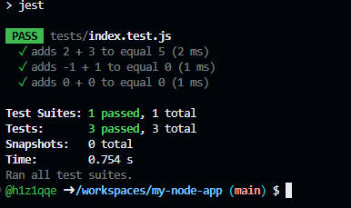
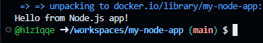
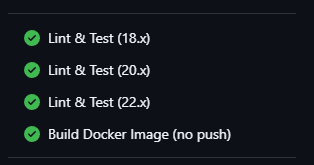
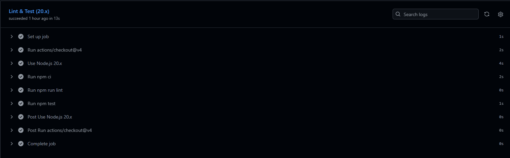

# 🟢 my-node-app

> Учебный проект: Node.js-приложение с CI-пайплайном в **GitHub Actions** —
> линтер **ESLint**, тесты **Jest** на матрице из 3 версий Node.js и сборка **Docker-образа**.
> Вся разработка выполнена в **GitHub Codespaces** — без установки Node.js и Docker на локальную машину.

## ✨ Что проверяет CI

| Job | Что делает |
|---|---|
| **Lint & Test** ×3 (Node 18.x / 20.x / 22.x) | `npm ci` → линт `eslint` → тесты `jest` |
| **Build Docker Image (no push)** | после успешных тестов собирает Docker-образ на раннере GitHub (только пуши в `main`) |

## 🗂 Структура проекта

~~~text
my-node-app/
├── .github/
│   └── workflows/
│       └── ci.yml        # GitHub Actions workflow
├── img/                  # скриншоты отчёта
├── src/
│   └── index.js          # функция add() + точка входа
├── tests/
│   └── index.test.js     # тесты Jest
├── package.json          # зависимости и скрипты
├── package-lock.json     # фиксация версий (нужен для npm ci и кэша)
├── .eslintrc.json        # конфиг ESLint
├── Dockerfile
└── README.md
~~~

## 🛠 Ход работы (GitHub Codespaces)

### Шаг 1 — репозиторий и Codespace
Создан публичный репозиторий `my-node-app` с README, затем открыт Codespace:
**Code → Codespaces → Create codespace on main**. Node.js, npm, Docker и git уже предустановлены.

### Шаг 2 — структура проекта

~~~bash
mkdir -p .github/workflows src tests && touch .github/workflows/ci.yml src/index.js tests/index.test.js package.json .eslintrc.json Dockerfile README.md
~~~

### Шаг 3 — код приложения и тесты
`src/index.js` — функция `add(a, b)` и `main()` с приветствием (запуск только при прямом вызове через `require.main === module` — поэтому тесты не печатают лишний вывод).
`tests/index.test.js` — три проверки: `2+3=5`, `-1+1=0`, `0+0=0`.

### Шаг 4 — конфиг ESLint
`.eslintrc.json`: среда `node` + глобальные переменные `jest` (чтобы `test`, `expect` не помечались как неизвестные), набор `eslint:recommended`, ECMAScript 2021.

### Шаг 5 — CI workflow
`.github/workflows/ci.yml`:
- **матрица из 3 версий Node.js** (18.x, 20.x, 22.x);
- `actions/setup-node` с кэшем npm — работает благодаря закоммиченному `package-lock.json`;
- `npm ci` — воспроизводимая установка ровно тех версий, что в lock-файле;
- job `docker-build` зависит от тестов (`needs: test`) и запускается только при пуше в `main`.

### Шаг 6 — генерация package-lock.json

~~~bash
npm install --package-lock-only
~~~

Lock-файл обязателен: без него падают и `cache: 'npm'` в workflow, и `npm ci` — и в CI, и внутри Dockerfile.

### Шаг 7 — тесты и линт локально

~~~bash
npm ci
npm run lint
npm test
~~~

~~~text
PASS tests/index.test.js
  ✓ adds 2 + 3 to equal 5 (2 ms)
  ✓ adds -1 + 1 to equal 0 (1 ms)
  ✓ adds 0 + 0 to equal 0 (1 ms)

Tests: 3 passed, 3 total
~~~

ESLint завершился без замечаний (пустой вывод = код чист).

### Шаг 8 — сборка Docker-образа

~~~bash
docker build -t my-node-app:latest .
docker run --rm my-node-app:latest
~~~

~~~text
Hello from Node.js app!
~~~

### Шаг 9 — пуш и результат в Actions

~~~bash
git add -A && git commit -m "Add Node.js app with CI" && git push
~~~

Все 3 job'а матрицы и сборка Docker-образа — зелёные ✅

## 🚀 Быстрый старт

~~~bash
git clone https://github.com/h1z1qqe/my-node-app.git
cd my-node-app
npm ci
npm test
npm start

# или через Docker:
docker build -t my-node-app:latest . && docker run --rm my-node-app:latest
~~~

## ⚙️ Как устроен pipeline

~~~text
push / PR → Lint & Test ×3 (18.x | 20.x | 22.x): npm ci → eslint → jest
                └── success + push в main → Build Docker Image (no push)
~~~

## 🧰 Технологии

`Node.js 18–22` · `GitHub Actions` · `ESLint` · `Jest` · `Docker` · `GitHub Codespaces`

## ✅ Выводы

- Настроил матричное тестирование: один workflow проверяет код сразу на 3 версиях Node.js.
- Разобрался, зачем нужен `package-lock.json`: воспроизводимость установок, работа кэша и `npm ci`.
- Настроил ESLint так, чтобы он понимал глобальные переменные Jest и не давал ложных срабатываний.
- Собрал Docker-образ на базе `node:18-alpine` прямо на раннере GitHub.
- GitHub Codespaces закрывает всю инфраструктуру: редактор, терминал, Docker — в браузере.
